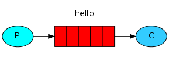
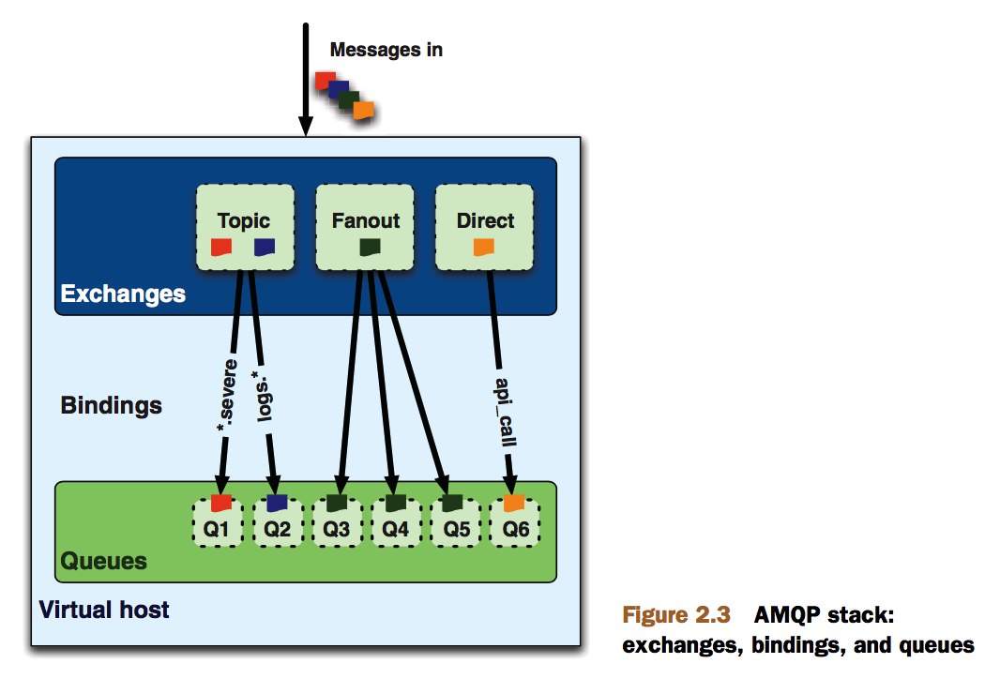
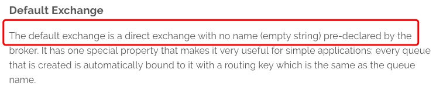

> RabbitMQ - Messaging that just works

推荐[博客](http://liaoph.com/rabbitmq-and-oslo-messaging/)

首先是RabbitMQ的基本操作，参考[官方内容](http://www.rabbitmq.com/getstarted.html)

# 1、Hello World

消息队列的基本要求，发送以及接收消息

简单来说，先上代码 [send.py](https://github.com/rabbitmq/rabbitmq-tutorials/blob/master/python/send.py)、[receive.py](https://github.com/rabbitmq/rabbitmq-tutorials/blob/master/python/receive.py)

代码详解:

#### 打开连接

    connection = pika.BlockingConnection(pika.ConnectionParameters(host='localhost'))
    channel = connection.channel()

当代码运行到这一步时,可使用如下命令查看到建立的连接

pid为12602

    ps axu|grep receive.py
    root     12602  1.0  0.0 215300 13476 pts/0    S+   08:27   0:00 python receive.py

端口为34628

    netstat -apn|grep 12602
    tcp6       0      0 ::1:34628               ::1:5672                ESTABLISHED 12602/python

看到打开一个连接

    rabbitmqctl list_connections|grep 34628
    guest   ::1 34628   running

#### 创建Queue(队列)

    channel.queue_declare(queue='hello')

创建消息队列

    rabbitmqctl list_queues|grep hello
    hello   0

#### 设置callback

设置callback函数,hello队列里每次消息都会调用callback函数，no_ack表示不需要消息确认，这个后文讲到

    def callback(ch, method, properties, body):
        print(" [x] Received %r" % body)

    channel.basic_consume(callback,
                          queue='hello',
                          no_ack=True)

#### 开始监听

    print(' [*] Waiting for messages. To exit press CTRL+C')

    channel.start_consuming()

#### 发送消息

发送消息,exchange，routing_key分别设置为空和hello(队列名字)

    channel.basic_publish(exchange='',
                          routing_key='hello',
                          body='Hello World!')

#### 关闭连接

    connection.close()

## Exchange与Queue

exchange、queue、binding是amqp的概念，也就是我们消息队列里的概念,以下是一张很不错的图片

* 生产者发送消息进入RabbitMQ，首先进入Exchange，Exchange会把消息分发到不同的Queue里面
* 消费者从Queue里面获取消息

Exchange 有4种，分别是direct、fanout、topic 和 headers，上文HelloWorld示例中，生产者发送消息的时候，使用的是 名字为空的Exchange，这个Exchange是一个特殊的Exchange，由RabbitMQ自己创建，类型是direct，direct类型的Exchange默认行为是 把消息转发到 和 routing_key 名字一样的queue中

[参考链接](https://www.rabbitmq.com/tutorials/amqp-concepts.html)

# 2、Work queues

这是1个生产者，2个消费者的普通模型。继续上代码[new_task.py](http://github.com/rabbitmq/rabbitmq-tutorials/blob/master/python/new_task.py)、[worker.py](http://github.com/rabbitmq/rabbitmq-tutorials/blob/master/python/worker.py)

# 3、Publish/Subscribe

# 4、Routing

# 5、Topics

# 6、RPC
