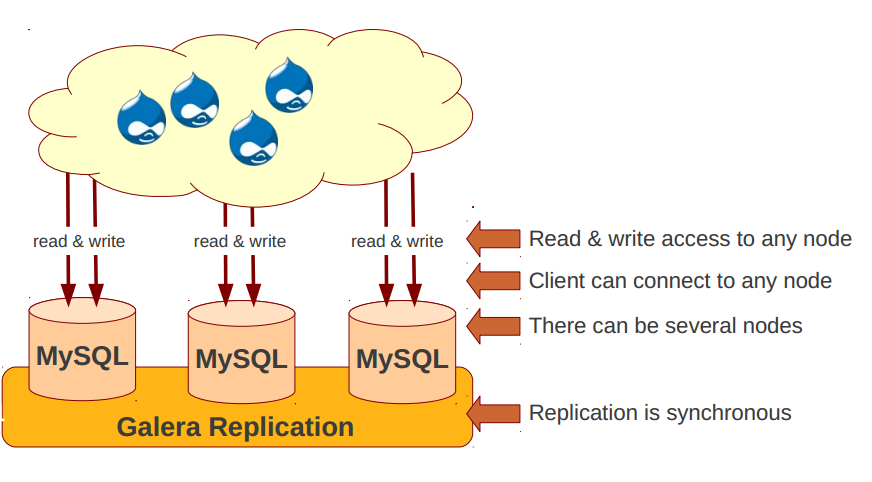
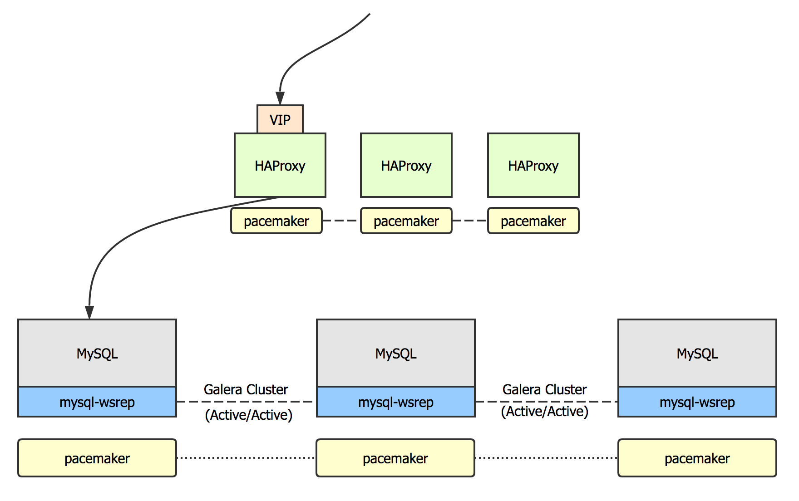
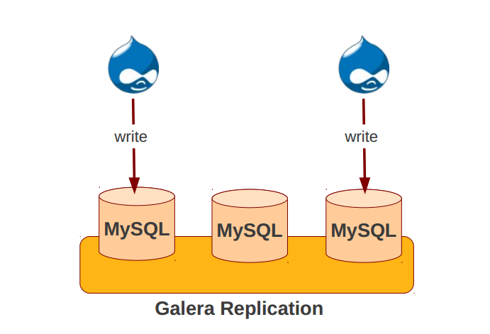
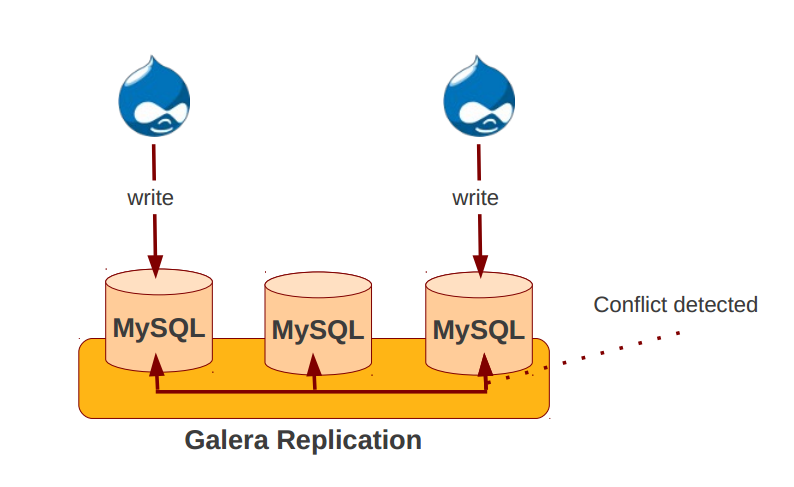
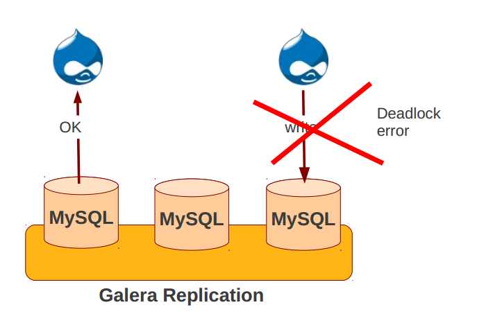

# 数据库的高可用

在设计一个高可用架构时，各种不通类型的组件高可用的方案往往不同，其中往往可以大致分为：

* 有状态服务
* 无状态服务

其中又以有状态服务的高可用最难实现，而 MySQL 数据库的高可用则是这些服务中最为棘手的一个问题。数据库通常作为应用程序的数据存储服务，要实现数据库的高可用，必然要使用的技术就是数据的复制。对于 MySQL 来说，有这些复制方式：

* 主从复制（异步）
* 使用 google 半同步复制插件（半同步）
* 主主复制（需要解决主键冲突）

实现复制之后，数据可以分布到多个 MySQL 数据库实例中，为了完成高可用，还需要进行故障数据库的切换，常用的方案有：

* MHA
* MMM

无论使用上述何种数据库技术，都可能会面临这些问题：

* 数据库的切换是否会造成数据丢失
* 主从角色如何切换
* 当需要切换时，如何选出最合适的节点（即包含数据量最多的节点）
* 当故障节点恢复后，如何将其加入到集群中
* 以上操作哪些需要手工完成

很遗憾，参考和试用了市面上大部分的数据库高可用方案，都没能够很好的解决以上问题。直到遇见 Galera Cluster.

# Galera Cluster
## Galera Cluster 是什么
Galera Cluster 是一个基于 MySQL/InnoDB 的**同步**，**多主**数据库集群框架。使用 Galera Cluster 构建数据库集群，集群中的**任意节点在任意时刻都是可读可写**的。Galera Cluster 集群底层的数据库服务器是 MySQL, MariaDB 或 Percona XtraDB，使用 Galera 的复制插件来管理复制。这个复制插件的 API 被称为 Write-Set Replication API(wsrep API)。

通过 wsrep API，Galera Cluster 实现了**基于认证的复制**。复制中的一个事务被称为 write-set ，其中不仅包含有需要复制的行数据，还包含有事务过程中数据库的锁信息。每个节点的都会对其接受队列中的 write-set 进行认证，如果 write-set 与节点自身的数据没有冲突，那么这个 write-set 就可以被应用到本地。当所有节点全部认证后，一个 write-set 的事务就被认为提交成功。



Galera Cluster 的优点：

* 多主：任何时刻任意节点都可读可写
* 同步复制：不会出现复制延迟
* 紧耦合：所有节点状态一致
* 多线程复制
* 对应用程序透明：一般不需要修改应用程序

## 基于认证的复制

在搞清楚 Galera 复制模型之前，先要了解以下概念：

### 同步复制和异步复制

* 同步复制：一个事务在提交并应用到主节点之前，必须确保此事务的数据已经发送到所有的节点并且可以应用到所有节点中。
* 异步复制：事务可以直接在主节点提交，然后再将数据传输至剩余节点应用。

通常来说，同步复制相比异步复制有如下这些优势：

* 高可靠性（节点的宕机不会导致数据丢失）
* 事物的顺序性保证（使用异步复制可能出现一个节点提交的事物在另外的节点查询不到的情况）

但是同步复制也会带了很多其他的问题，例如主键冲突，或者死锁等问题。因此异步复制仍然是主流的复制方式，MySQL 和 PostgreSQL 默认都只提供异步复制。

Galera Cluster 为了解决同步复制中的问题，引入了一种叫做 Certification-based replication 的复制方式。

### 基于认证的复制的工作过程

Galera Cluster 实现了基于认证的复制，它使用集群间通信和事务排序的技术来实现同步复制。
事务首先会在一个节点执行，当事务需要提交时，会需要一个集群协商的认证过程来确保全局的一致性，只有能够保证**全局一致性**的事务才会被成功提交。

基于认证的复制需要这些条件：

* 事务性数据库：数据库必须是事务性的，因为必须要支持回滚（事务可能提交不成功）
* 原子性修改：对数据库的修改要么完全成功，要么完全失败
* 全局顺序：所有的事务必须是有顺序标记的，以确保它们在所有节点都以相同的顺序执行

基于认证的复制中，事务在提交之前，都是正常执行的，而不会考虑冲突的问题。这叫做**乐观执行**。


Galera 的复制是基于事物的。上图是一个事物在集群中进行复制的瀑布流。

当客户端开启一个事物，进行数据的修改，在它执行 `COMMIT` 之前，这个事务所执行的所有修改和修改涉及到的所有主键被合并到一个 write-set 中，数据库会将这个 write-set 发送到其他所有节点。
然后这个 write-set 会进行认证测试，认证会使用 write-set 中的主键信息。所有节点，检测接受队列中 write-set 的主键与节点本地事务是否有冲突，以决定此 wirte-set 是否能被应用到本地节点。
如果认证测试失败，那么这个 wirte-set 被丢弃，事务进行回滚操作。如果认证测试成功，事务被提交，write-set 被应用到集群中的其余节点中。

在 Galera Cluster 中，每个事务都有一个全局的序列号（seqno, sequence number），当一个事务需要提交时，每个节点会将此事务的序列号与本节点最后一次成功提交的事务的序列号进行比较，在这两个事务之间的所有未提交的事务都会被用来进行主键冲突测试，如果需要提交的事务与在此区间的事务有主键冲突的可能，那么认证测试会失败。

## Galera Cluster 的组件


Galera Cluster 有下面的组件：

* DBMS：数据库服务，可以使用 MySQL, MariaDB 或 Percona XtraDB
* wsrep API：数据库服务和复制源之间的接口
* Galera Replication Plugin：提供 write-set 复制功能的插件
* Group Communication Plugins：集群事务信息层插件，支持 TCP 通信 和 UDP 多播通信

### WSREP API
wsrep API 是一个通用的数据库复制模型，在它的模型中，每个数据库服务器都有状态（state）。状态指的就是这个数据库的所有数据内容。在使用数据库时，一旦修改了数据库中的数据，数据库的状态就发生了变化。wsrep API 把这些变化表示一系列的数据库事物。

在数据库集群中，任何时刻所有子成员的状态都是一致的。因此 wsrep 需要使用全局事务 ID（GTID）。并且需要对所有的事物进行排序，例如下面是一个全局事务 ID：

```
45eec521-2f34-11e0-0800-2a36050b826b:94530586304
```

GTID 由两部分组成：

* State UUID：用来表示状态版本的 UUID
* 序列号：一个 64 位的整数，用来表示这个事物在事物序列中的顺序位置

使用 GITD 可以方便的比较节点间状态的差异，并且能够对所有的状态修改进行排序。

## STATE TRANSFERS
Galera Cluster 集群中，当新加入一个节点时，此节点需要从集群节点获取数据，这个复制过程被称作状态传输（State Transfer），Galera Cluster 有两种状态传输方式：

1. State Snapshot Transfers (SST) 传输一个节点的完成状态（即所有数据），全量复制
2. Incremental State Transfers (IST) 只传输缺失的数据，增量复制

### STATE SNAPSHOT TRANSFER (SST)
在 SST 中，传输数据的节点会将完整的数据拷贝到其他节点，传输数据的节点通常被称作供给者（donor ）。当一个新节点加入到一个已有的集群时，会使用 SST 来传输和同步数据。有下面几种方式可供选择：

* 逻辑复制：这种方式使用 `mysqldump` 工具进行数据拷贝，使用这种方式时，**donor 节点会变为 READ-ONLY 状态**，在 donor 节点会执行 `FLUSH TABLES WITH READ LOCK` 进行只读状态。mysqldump 是最慢的复制方式。
* 物理复制：这种方式可以使用 `rsync`, `rsync_wan` 和 `xtrabackup` 等工具来在服务器之间拷贝数据。这种方式比 `mysqldump` 的方式要快，但是需要新加入节点和 donor 节点的配置相同。

### INCREMENTAL STATE TRANSFER (IST)

使用 IST 的方式时，集群会判断加入集群的节点所缺失的数据，而不必传输完整的数据集。使用 IST 必须满足特定的条件：

* 加入节点的 state UUID 必须和此集群的相同（即加入节点曾经属于此集群）
* 加入节点所缺失的数据都在 donor 节点的 write-set cache 中存在
* 使用 IST 最重要的参数是 donor 节点的  `gcache.size` 大小，这个参数表示从系统内存中分配多少大小用于缓存 write set。缓存的空间越多，能够使用 IST 的几率就越大。

### Write-set Cache(GCache)
Galera Cluster 中存储 write-sets 的特殊缓存叫做 Write-set Cache 或 GCache. Galera Cluster 为了减少内存的使用，会将内存中的 write-set 写入到磁盘中。

GCache 使用三种类型的存储：

* Permanent In-Memory Store：直接使用操作系统的内存，适合有很多空余内存的系统，默认情况是禁用的。
* Permanent Ring-Buffer File：在缓存初始化时就预先分配的一块磁盘空间，默认情况下，它的大小是 128Mb。
* On-Demand Page Store：根据需要在运行时动态分配的内存映射页文件，默认情况下是 128Mb，但如果需要更大的 write-set，它可以动态的增长。当 page file 不再使用时，Galera Cluster 会删除这些文件，可以对 page file 的总大小进行限制。

Galera Cluster 的缓存分配算法会按上面的顺序来分配缓存空间，gcache.dir 参数可以指定缓存保存在磁盘的位置。

## 故障和恢复

**Primary Component**
Primary Component 包含了集群中能互相保持心跳通信的节点，Primary Component 中节点数量必须大于集群节点数的一般，即如果集群总节点数为 3，那么 Primary Component 中节点数必须大于或等于 2. 只有属于 Primary Comonent 中的节点才能正常对外提供服务。因此 Galera 集群一般使用奇数个节点。

Galera Cluster 会周期性的检查每个节点的连接是否正常， `evs.inactive_check_peroid` 参数可以设置检查的周期。如果一个节点的失效时间超过了 `evs.suspect_timeout` 的值，那么节点将被标记为 suspect。如果 Primary Component 中的所有节点都将某个节点标记为 suspect ，那么此节点被移出集群。

如果一个节点的失效时间超过了 `evs.inactive_timeout` 的值，此节点将直接被移出集群而不需要协商。故障的节点将不可读不可写。

## 集群可用性和分区容忍性和

根据 [CAP 理论](http://en.wikipedia.org/wiki/CAP_theorem)，Galera Cluster 更强调数据的安全和一致性。因此需要在集群的可用性与分区容错性之间进行取舍，因此需要设置合适的 `evs.suspect_timeout` 和 `evs.inactive_timeout` 的值。 `evs.suspect_timeout` 的值决定了检测一个失效节点的最短时间。

# Galera Cluster 的安装

前面已经介绍过了，Galera Cluster 是一个主主同步的复制框架，它通过 wsrep API 和数据库系统进行结合。而数据库系统可以选择 MySQL, MariaDB 和 Percona XtraDB.

这里，建议使用 MariaDB 10.1.1 以上的版本，因此从 10.1 开始，MariaDB 自身就自带了 Galera 的支持。在 MariaDB 10.1 以上的版本中使用 Galera 另安装额外的组件。具体可以参考[这里](https://mariadb.org/mariadb-10-1-1-galera-support/)

## 手动安装

这里使用三台 CentOS7 的机器，首先加入 MariaDB 的 yum 源：

```
[mariadb]
name = MariaDB
baseurl = http://yum.mariadb.org/10.1/centos7-amd64
gpgkey=https://yum.mariadb.org/RPM-GPG-KEY-MariaDB
gpgcheck=1
```

然后安装 MariaDB

```
$ yum -y install MariaDB-server galera
```

安装后之后，需要对数据库进行配置，除了 MySQL 数据库自身的配置之外，还需要对 galera cluster 进行配置，这里列举一些常用的参数：

```
wsrep_on = ON
binlog_format=ROW                  #使用 gelera cluster 建议将二进制日志设置为 ROW 格式的
default_storage_engine=innodb      #必须使用事务性存储引擎
innodb_autoinc_lock_mode=2         #自增键的锁模式，防止主键冲突
wsrep_provider=/usr/lib64/galera/libgalera_smm.so     #wsrep 插件库文件位置
wsrep_provider_options="gcache.size=300M; gcache.page_size=1G"  #wsrep 的配置选项，可以设置 GCache 的大小
wsrep_cluster_name="example_cluster"   #集群的名字
wsrep_cluster_address="gcomm://IP.node1,IP.node2,IP.node3"      #集群所有节点的 IP 地址
wsrep_sst_method=rsync             #SST 的复制方式
```

### 初始化

Galera Cluster 安装完成后，必须先要初始化集群的 Primary Component，之后集群中启动的节点将自动连接 Primary Component 复制数据。

默认情况下，节点会假设集群中已经有了 Primary Component，节点在启动后会自动去寻找集群中的 Primary Component，并尝试向其请求同步数据。一个新的集群首先要初始化一个 Primary Component，使用 `--wsrep-new-cluster` 启动数据库，数据库将成为 Primary Component，MariaDB 提供了一个 `galera_new_cluster` 的命令用于启动初始节点：

```
$ gelera_new_cluster
```

将一个节点初始化为 Primary Component 后，可以通过 `wsrep_cluster_size` 状态变量的值来查看集群中有效节点的数量：

```
mysql> SHOW STATUS LIKE 'wsrep_cluster_size';
+--------------------+-------+
| Variable_name      | Value |
+--------------------+-------+
| wsrep_cluster_size | 1     |
+--------------------+-------+
```

### 添加剩余节点

接下来可以添加剩余的节点，直接使用正常方式启动节点即可，新启动的节点会自动寻找集群中的 Primary Component 并自动加入其中。可以通过 wsrep_cluster_size 来查看集群中有有效节点的数量。

集群工作后，可以通过下面的状态变量查看集群状态：

```
mysql> SHOW STATUS LIKE 'wsrep_%';
+---------------------------+------------+
| Variable_name             | Value      |
+---------------------------+------------+
...
| wsrep_local_state_comment | Synced (6) |
| wsrep_cluster_size        | 3          |
| wsrep_ready               | ON         |
+---------------------------+------------+
```

`wsrep_local_state_comment` 表示本地节点的状态， Synced 表示已经和集群的 Primary Component 保持同步，`wsrep_cluster_size` 表示集群有效节点的数量，`wsrep_ready` 表示本地节点是否能够处理客户端请求。

此时使用 killall -9 mysqld 杀掉某一个节点的 数据库进程，查看集群其他节点的状态。

### 数据传输方式

之前有讨论过，Galera 在进行 SST 全量数据传输时可以使用：

* rsync
* mysqldump
* xtrabackup

其中，使用 mysqldump 和 rsync 时，传输数据的节点（donor）是不可以对外提供服务的。这里其实最好使用 xtrabackup 的方式，使用 xtrabackup 时，donor 状态的节点也是能对外提供服务的（使用 MVCC 技术）。使用 xtrabackup 的配置方式需要配置好传输的用户名，密码，并事先在数据库中创建对应的用户。这里贴一个参考的配置：

```
wsrep_on = ON
...
wsrep_slave_threads = 8
wsrep_sst_auth = "sst_user:sst_passwd"
wsrep_sst_method = xtrabackup-v2
wsrep_sst_receive_address = 10.0.2.50

[sst]
sockopts = nodelay,sndbuff=1048576,rcvbuf=1048576
streamfmt = xbstream
transferfmt = socat

[xtrabackup]
parallel = 4
```

这里制定了使用 xtrabackup 进行流式备份，并通过 socat 传输数据到其他节点，以及传输所使用的用户名和密码。在使用这种方式之前，必须先创建好相应的数据库用户，并安装 `percona-xtrabackup` 和 `socat` 两个包。

## 通过 Puppet 安装

Galera Cluster 的配置是一个相对复杂的过程，使用 Puppet 可以一键自动化部署整个集群。社区已经有相应的模块，这里不做过多赘述。

可以参考：

[puppet-galera 模块](https://github.com/fuel-infra/puppet-galera.git)

[fuel 的部署代码（包含 pacemaker/corosync）](https://github.com/openstack/fuel-library/blob/master/deployment/puppet/osnailyfacter/manifests/database/database.pp)

# 高可用方案和部署策略

Galera Cluster 由于使用主主同步复制，节点的故障转移和切换会比较简单，使用反向代理即可。需要注意的是，即使一个 Galera 节点处于在线状态，它也可能是不能对外提供服务的（可能处于 donor 状态，即正在向其他节点传输数据）。

我们可以选用 HAProxy + Galera Cluster 的方案实现高可用，同时，使用 pacemaker 或 keepalived 对 HAProxy 进行高可用。为了能让 HAProxy 能够检测到后端 Galera 节点的状态，这里还需要使用额外的脚本进行检测，当数据库为 donor 状态时，也是不可以对外提供服务的。

此脚本的 github 地址为： [https://github.com/olafz/percona-clustercheck](https://github.com/olafz/percona-clustercheck)

此项目是一个通过 xinetd 运行的微型 Http 服务，脚本的内容可以看出，它会对 galera 整个集群的状态进行判断，包含检查 `wsrep_local_state` 状态变量的值，检查 `read_only` 的值。如果两个状态值都正常，那么脚本通过 HTTP 协议返回 200，否则返回 503.

```
WSREP_STATUS=$($MYSQL_CMDLINE -e "SHOW STATUS LIKE 'wsrep_local_state';" \
    2>${ERR_FILE} | tail -1 2>>${ERR_FILE})

if [[ "${WSREP_STATUS}" == "4" ]] || [[ "${WSREP_STATUS}" == "2" && ${AVAILABLE_WHEN_DONOR} == 1 ]]
then
    # Check only when set to 0 to avoid latency in response.
    if [[ $AVAILABLE_WHEN_READONLY -eq 0 ]];then
        READ_ONLY=$($MYSQL_CMDLINE -e "SHOW GLOBAL VARIABLES LIKE 'read_only';" \
                    2>${ERR_FILE} | tail -1 2>>${ERR_FILE})

        if [[ "${READ_ONLY}" == "ON" ]];then
            # Percona XtraDB Cluster node local state is 'Synced', but it is in
            # read-only mode. The variable AVAILABLE_WHEN_READONLY is set to 0.
            # => return HTTP 503
            # Shell return-code is 1
            echo -en "HTTP/1.1 503 Service Unavailable\r\n"
            echo -en "Content-Type: text/plain\r\n"
            echo -en "Connection: close\r\n"
            echo -en "Content-Length: 43\r\n"
            echo -en "\r\n"
            echo -en "Percona XtraDB Cluster Node is read-only.\r\n"
            sleep 0.1
            exit 1
        fi
    fi
    # Percona XtraDB Cluster node local state is 'Synced' => return HTTP 200
    # Shell return-code is 0
    echo -en "HTTP/1.1 200 OK\r\n"
    echo -en "Content-Type: text/plain\r\n"
    echo -en "Connection: close\r\n"
    echo -en "Content-Length: 40\r\n"
    echo -en "\r\n"
    echo -en "Percona XtraDB Cluster Node is synced.\r\n"
    sleep 0.1
    exit 0
else
    # Percona XtraDB Cluster node local state is not 'Synced' => return HTTP 503
    # Shell return-code is 1
    echo -en "HTTP/1.1 503 Service Unavailable\r\n"
    echo -en "Content-Type: text/plain\r\n"
    echo -en "Connection: close\r\n"
    echo -en "Content-Length: 44\r\n"
    echo -en "\r\n"
    echo -en "Percona XtraDB Cluster Node is not synced.\r\n"
    sleep 0.1
    exit 1
fi
```

脚本的部署需要启动 xinetd 服务，配置好 xinetd 的配置文件：

```
$ cat /etc/xinetd.d/galeracehck
service mysqlchk
{
        disable = no
        flags = REUSE
        socket_type = stream
        port = 49000
        wait = no
        user = nobody
        server = /usr/bin/clustercheck
        log_on_failure += USERID
        only_from = 0.0.0.0/0
        per_source = UNLIMITED
}
```

这里监听的端口是 49000，我们可以在运行 galera 的节点上测试，检查本节点的状态：

```
$ curl -I http://localhost:49000
HTTP/1.1 200 OK
Content-Type: text/plain
Connection: close
Content-Length: 40
```

结合 HAProxy 时，HAProxy 的配置为：

```
listen mysql
  bind 0.0.0.0:3306
  mode tcp
  balance source
  option tcplog
  option clitcpka
  option srvtcpka
  option httpchk
  timeout client 48h
  timeout server 48h
  server mysql-2 10.0.2.51:3306 check port 49000 inter 5000 rise 2 fall 3 backup
  server mysql-3 10.0.2.52:3306 check port 49000 inter 5000 rise 2 fall 3 backup
  server mysql-1 10.0.2.50:3306 check port 49000 inter 10s fastinter 2s downinter 3s rise 3 fall 2
```

这里需要主要的是，这里使用了 httpchk 对 49000 端口进行检测而不是简单的端口检测，并且只有一个节点对外提供服务，另外两个节点为 backup 节点。为什么要这样使用呢？这是因为 Galera 目前不支持 `SELECT FOR UPDATE` 类型锁的复制，因此某些应用场景下，多主同时写入会出现问题。

例如在 OpenStack 场景下，同一时间就只能有一个对外提供服务，否则可能造成问题，具体可以参考：

1. [IMPORTANT: MySQL Galera does *not* support SELECT ... FOR UPDATE](http://lists.openstack.org/pipermail/openstack-dev/2014-May/035264.html)
2. [Understanding reservations, concurrency, and locking in Nova](http://www.joinfu.com/2015/01/understanding-reservations-concurrency-locking-in-nova/)

最后，不要忘了对 HAProxy 本身进行高可用。可以使用 pacemaker/keepalived 等软件实现。

除了使用 HAProxy + 自定义检查脚本的方式之外，还可以使用 ProxySQL 作为 MySQL 的代理，具体的使用方式可以参考[这里](http://www.proxysql.com/blog/galera-awareness-and-proxysql-scheduler)。

## 集群的自动恢复

即使使用了 galera cluster，如果出现了集群全部节点宕机的情况，那么此时就需要人工找到数据量最多的节点（最后宕的节点），以此为初始节点，然后启动整个集群。这些人工操作能否通过自动化的方式完成呢？

答案是可以的，Fuel 已经使用 pacemaker + 自定义脚本实现了此功能，通过 pacemaker 管理 Galera 集群，能够做到集群的自动恢复，故障转移等功能。脚本的地址在：[https://github.com/openstack/fuel-library/blob/master/files/fuel-ha-utils/ocf/mysql-wss](https://github.com/openstack/fuel-library/blob/master/files/fuel-ha-utils/ocf/mysql-wss)，这里不进行详细赘述了。

最终，我们实现的高可用方案架构如下所示：



# Galera Cluster 使用的一些问题探讨

## 处理多主冲突

当两个客户端写入的事务存在冲突时，服务器检测到冲突，将会拒绝冲突的事务提交，如下面的图所示：







Galera 使用乐观的并发控制，冲突的事务只有在提交时才会进行冲突检测，冲突的事务被拒绝提交，返回 deadlock error，应用程序在收到 deadlock error 后应该重试写入事务，而然这可能涉及到应用程序代码的重构（不现实）。

如果集群经常出现写入冲突，可以开启 `wsrep_debug` 选项，所有的冲突将会被记录到日志中，同时可以观测 `wsrep_local_bf_aborts` 和 `wsrep_local_cert_failure` 的值来查看写入冲突的数量。

**wsrep_retry_autocommit**

这个参数可以在写入冲突后自动代替应用程序尝试重新写入失败的事务，`wsrep_retry_autocommit=n`决定了 Galera 在返回 deadlock erro 之前尝试重新写入的次数。重试写入只能对使用 `autocommit` 的事务生效。

**多主冲突问题的要点**
1. 分析数据热区
2. 检查应用程序逻辑是否能够修改，让应用程序能够自动重试失败的事务
3. 配置 `wsrep_retry_autocommit`
4. 限制主节点的数量，或者切换为主从模型


