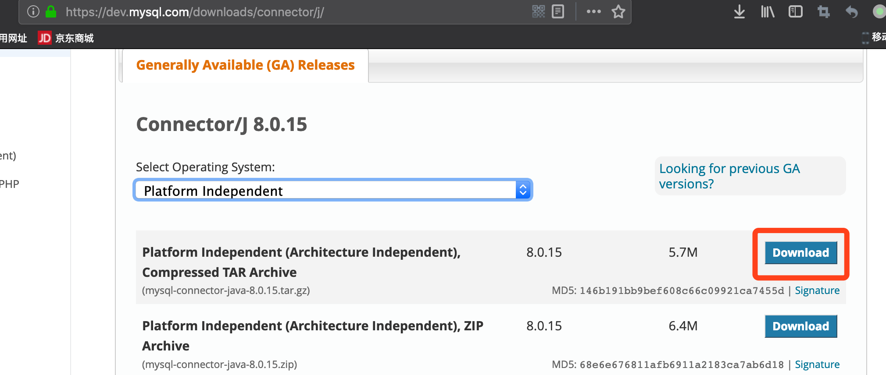
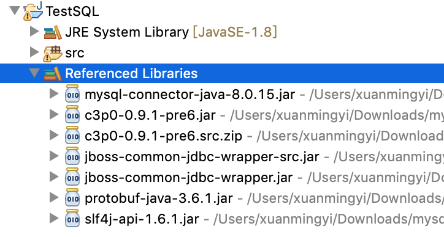

Title: Java与SQL打交道(1) - JDBC
Date: 2019-04-10 07:36
Category: Java
Tags: java, jdbc, MySQL
Slug: java-jdbc-sql-1
Authors: Xuan Mingyi

我们经常需要使用Java与SQL打交道,Java与SQL交互有很多类库,很多名词比如

* JDBC
* MyBatis
* JPA
* Hibernate
* Spring Data
* ...

我们将一一学习使用,理清楚他们之间的关系以及封装。

首先，我们选取一个数据库作为测试用例,这里先使用MySQL，如下。

创建一张测试user表

    :::text
    $ mysql -uroot -hlocalhost
    Welcome to the MariaDB monitor.  Commands end with ; or \g.
    Your MariaDB connection id is 20
    Server version: 10.2.22-MariaDB Homebrew
    
    Copyright (c) 2000, 2018, Oracle, MariaDB Corporation Ab and others.
    
    Type 'help;' or '\h' for help. Type '\c' to clear the current input statement.
    
    MariaDB [(none)]> use test
    Database changed
    
    MariaDB [test]> create table user(username varchar(32), password varchar(32), sex tinyint(1));
    Query OK, 0 rows affected (0.01 sec)
    
    MariaDB [test]> desc user;
    +----------+-------------+------+-----+---------+-------+
    | Field    | Type        | Null | Key | Default | Extra |
    +----------+-------------+------+-----+---------+-------+
    | username | varchar(32) | YES  |     | NULL    |       |
    | password | varchar(32) | YES  |     | NULL    |       |
    | sex      | tinyint(1)  | YES  |     | NULL    |       |
    +----------+-------------+------+-----+---------+-------+
    3 rows in set (0.01 sec)
    
    MariaDB [test]>

## 环境设置

下载MySQL的JDBC包

加入项目依赖

## 连接

数据库使用之前先需要先连接数据库，获得数据库连接的conn

    :::java
    // 数据库连接URI
    String driverName = "com.mysql.cj.jdbc.Driver";
    String url = "jdbc:mysql://localhost:3306/test";
    String user = "root";
    String password = "";
    Connection conn = null;
    
    try {
        // 加载驱动
        Class.forName(driverName);
        
        // 获取连接
        conn = DriverManager.getConnection(url, user, password);
    
        System.out.println("连接成功");
    
    } catch (ClassNotFoundException e){
        e.printStackTrace();
    } catch (SQLException e) {
        e.printStackTrace();
    }

## 操作
### 增

插入一条数据

    :::java
    String sql = "insert into user (username, password, sex) values(?, ?, ?)";
    PreparedStatement pstmt;
    try {
		pstmt = (PreparedStatement) conn.prepareStatement(sql);

		pstmt.setString(1, "xuanmingyi");
		pstmt.setString(2, "iygnimnaux");
		pstmt.setInt(3, 0);

        pstmt.executeUpdate();

        pstmt.close();
        conn.close();
	} catch (SQLException e) {
		// TODO Auto-generated catch block
		e.printStackTrace();
	}

`PreparedStatement`实例包含了已经编译的SQL语句,setXxxx方法来设置参数，然后执行executeUpdate来执行插入方法。

让我们来看看结果

    MariaDB [test]> select * from user;
    +------------+------------+------+
    | username   | password   | sex  |
    +------------+------------+------+
    | xuanmingyi | iygnimnaux |    0 |
    +------------+------------+------+
    1 row in set (0.00 sec) 

### 删

删除一条记录

    String sql = "delete from user where username=?";
    PreparedStatement pstmt;
    try {
        pstmt = (PreparedStatement) conn.prepareStatement(sql);

        pstmt.setString(1, "xuanmingyi");

        pstmt.executeUpdate();

        pstmt.close();
        conn.close();
    } catch (SQLException e) {
        // TODO Auto-generated catch block
        e.printStackTrace();
    }    

删除数据

    MariaDB [test]> select * from user;
    Empty set (0.00 sec)

### 改

修改一条记录,先插入一条数据

    MariaDB [test]> select * from user;
    +------------+------------+------+
    | username   | password   | sex  |
    +------------+------------+------+
    | xuanmingyi | iygnimnaux |    0 |
    +------------+------------+------+
    1 row in set (0.00 sec)

使用如下代码修改password

    :::java
    String sql = "update user set password=? where username= ?";
    PreparedStatement pstmt;
    try {
        pstmt = (PreparedStatement) conn.prepareStatement(sql);
        pstmt.setString(1, "123456");
        pstmt.setString(2, "xuanmingyi");
        pstmt.executeUpdate();

        pstmt.close();
        conn.close();
    } catch (SQLException e) {
        e.printStackTrace();
    }

使用update语句修改数据,就是这么简单

    MariaDB [test]> select * from user;
    +------------+----------+------+
    | username   | password | sex  |
    +------------+----------+------+
    | xuanmingyi | 123456   |    0 |
    +------------+----------+------+
    1 row in set (0.00 sec)

### 查

查找记录

    String sql = "select * from user";
    PreparedStatement pstmt;
    try {
        pstmt = (PreparedStatement)conn.prepareStatement(sql);
        ResultSet rs = pstmt.executeQuery();
        int col = rs.getMetaData().getColumnCount();
        while (rs.next()) {
            for (int i = 1; i <= col; i++) {
                System.out.print(rs.getString(i) + "\t");
             }
            System.out.println("");
        }
    } catch (SQLException e) {
        e.printStackTrace();
    }

返回值是`ResultSet`的实例，rs是一个迭代器,通过next方法一行行获取数据，getString(x)方法来获取第x列的数据，和上面的setString对应起来。

## 连接池问题 TODO

上面的代码里,我们使用`DriverManager.getConnection`方法 获取一个数据库连接，当不使用的时候，需要close。如果不close，会造成泄漏.

    :::java
    for(int i = 0 ; i < 5 ; i++) {
    	DriverManager.getConnection(url, user, password);
    }
    Thread.sleep(10000);

查看数据库的连接

    MariaDB [(none)]> show processlist;
    +-----+-------------+-----------------+------+---------+------+--------------------------+------------------+----------+
    | Id  | User        | Host            | db   | Command | Time | State                    | Info             | Progress |
    +-----+-------------+-----------------+------+---------+------+--------------------------+------------------+----------+
    |   1 | system user |                 | NULL | Daemon  | NULL | InnoDB purge coordinator | NULL             |    0.000 |
    |   2 | system user |                 | NULL | Daemon  | NULL | InnoDB purge worker      | NULL             |    0.000 |
    |   3 | system user |                 | NULL | Daemon  | NULL | InnoDB purge worker      | NULL             |    0.000 |
    |   4 | system user |                 | NULL | Daemon  | NULL | InnoDB purge worker      | NULL             |    0.000 |
    |   5 | system user |                 | NULL | Daemon  | NULL | InnoDB shutdown handler  | NULL             |    0.000 |
    |  37 | root        | localhost       | NULL | Query   |    0 | init                     | show processlist |    0.000 |
    | 443 | root        | localhost:54972 | test | Sleep   |    8 |                          | NULL             |    0.000 |
    | 444 | root        | localhost:54973 | test | Sleep   |    8 |                          | NULL             |    0.000 |
    | 445 | root        | localhost:54974 | test | Sleep   |    8 |                          | NULL             |    0.000 |
    | 446 | root        | localhost:54975 | test | Sleep   |    8 |                          | NULL             |    0.000 |
    | 447 | root        | localhost:54976 | test | Sleep   |    8 |                          | NULL             |    0.000 |
    +-----+-------------+-----------------+------+---------+------+--------------------------+------------------+----------+
    
如上造成了5个数据库连接的泄漏。

如果我们每次不使用了就关闭，使用就连接，则会造成连接次数过多，消耗过多资源。

解决上面的办法就是: 维护一个连接池，用的话从池里面获取一个。这样即快速，不需要每次都打开连接，又不至于连接过多。

[Java与SQL打交道(2) - 连接池](/java-jdbc-connection-pool-2.html)

## 对象问题 DONE

使用JDBC的接口，可以从MySQL中获取到数据，但是在Java中，我们不是直接使用String数据，而是使用一个个对象，这个时候，光JDBC就不够用了，需要使用ORM的框架。

[Java与SQL打交道(3) - JPA](/java-jpa-3.html)
