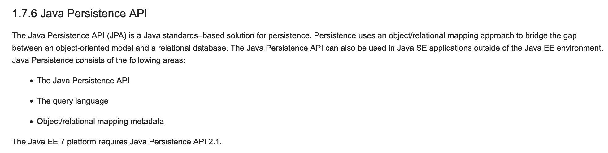

Title: Java与SQL打交道(3) - JPA
Date: 2019-04-11 08:31
Category: Java
Tags: java, JPA, MySQL
Slug: java-jpa-3
Authors: Xuan Mingyi

JPA是一种Java规范，不同框架对JPA有不同程度的支持。既然是规范，那就有制订者、版本、以及规范文件，参考[维基百科](https://zh.wikipedia.org/wiki/Java%E6%8C%81%E4%B9%85%E5%8C%96API)、[JPA Tutorial - Java Persistence API](www.javaguides.net/p/jpa-tutorial-java-persistence-api.html)我们来一探究竟。

从上面我们知道，比较重要的版本有 2.0、2.1以及2.2

#### JPA 2.0

[JSR 317: JavaTM Persistence 2.0](https://jcp.org/en/jsr/detail?id=317)

#### JPA 2.1

*2011年7月，JPA 2.1 在JCP的JSR 338请求中作为新版本开发。2013年5月22日，JPA 2.1被批准为最终正式标准。*

[Java EE 7 APIs](https://docs.oracle.com/javaee/7/tutorial/overview007.htm)

#### JPA 2.2 

这是最新的

[JSR 338: JavaTM Persistence 2.2](https://jcp.org/en/jsr/detail?id=338)

#### 说明
JPA的主要用途就是，来实现ORM的，盗张图。

下面我们找个框架来练练手，研究一下JPA的使用。

* Spring Data JPA

### Spring Data JPA

我们要用一个例子来展现极简方式实现User的增删改查

#### 实现实体类Entity

下面我们先展示一下要用到的User表

	MariaDB [test]> desc user;
	+----------+-------------+------+-----+---------+-------+
	| Field    | Type        | Null | Key | Default | Extra |
	+----------+-------------+------+-----+---------+-------+
	| username | varchar(32) | YES  |     | NULL    |       |
	| password | varchar(32) | YES  |     | NULL    |       |
	| sex      | tinyint(1)  | YES  |     | NULL    |       |
	+----------+-------------+------+-----+---------+-------+
	3 rows in set (0.02 sec)
	
定义一个实体类

    :::java
	import javax.persistence.Entity;
    import javax.persistence.Id;
    
    @Entity
    public class User{
        @Id
        private String username;

        private String password;
        private int sex;
    
        public String getUsername() {
            return username;
        }
    
        public void setUsername(String username) {
            this.username = username;
        }
    
        public String getPassword() {
            return password;
        }
    
        public void setPassword(String password) {
            this.password = password;
        }
    
        public int getSex() {
            return sex;
        }
    
        public void setSex(int sex) {
            this.sex = sex;
        }
    }

其中`username`作为主键，当然，这并不是一个好主意,最好使用一个自增的ID或者uuid作为主键。

#### 实现接口

这是一个CRUD的接口

    :::java
    import org.springframework.data.repository.CrudRepository;
    import java.util.List;
    
    public interface UserRepository extends CrudRepository<User, String> {
        List<User> findBySex(int sex);
        List<User> findAll();
    }

#### 使用

例子来源于[accessing-data-jpa](https://spring.io/guides/gs/accessing-data-jpa/)

    :::java
    User me = new User();
    me.setUsername("xuanmingyi");
    me.setPassword("iygnimnaux");
    me.setSex(1);
    repository.save(me);

以上就可以用了，还算比较方便。大部分语言的ORM都能做到。

其中需要注意的几个点就是:

* 如果不使用`@Table`注解，则默认实例类名和数据库表名一样。比如 `User类` 对应 `user表`。
* Spring Data JPA 还能从函数签名中推导出要求的逻辑，当然 只能是简单逻辑。碰到函数签名，想到一个有意思的问题，为啥C语言不能重载。

#### 函数签名

下面做一个实验来验证一下C和CPP的签名机制。

    :::cpp
    int test(){return 0;}
    int test2(){return 0;}
    int main(){return 0;}

使用c编译器,函数签名就是函数的名字

    :::
    # 使用c编译器
    $ gcc -c main.c -o main.c.o
    $ objdump -t main.c.o

    main.c.o:	file format Mach-O 64-bit x86-64
    
    SYMBOL TABLE:
    0000000000000020 g     F __TEXT,__text	_main
    0000000000000000 g     F __TEXT,__text	_mm
    0000000000000010 g     F __TEXT,__text	_mm2

使用cpp编译器,函数签名根据函数的名字以及参数列表

    :::
    # 使用cpp编译器
    $ gcc -c main.cpp -o main.cpp.o
    $ objdump -t main.cpp.o
    
    main.cpp.o:	file format Mach-O 64-bit x86-64
    
    SYMBOL TABLE:
    0000000000000000 g     F __TEXT,__text	__Z2mmv
    0000000000000010 g     F __TEXT,__text	__Z3mm2v
    0000000000000020 g     F __TEXT,__text	_main

SO: 名字一样，参数不同的函数，对C来说，就是一样的函数；对CPP而言，就是不一样的函数。

JAVA可以重载，所以，签名一定至少包含 名字以及参数列表

#### 优化

有一位JAVA前辈，老徐，提示我，可以使用lombok减少代码量

上面的User类可以改写成如下

    :::java
    import lombok.Data;
    
    import javax.persistence.Entity;
    import javax.persistence.Id;
    
    @Entity
    @Data
    public class User{
        @Id
        private String username;
        private String password;
        private int sex;
    
    }

代码少了一大堆，但我是不会夸Java的，这不是应该的吗？既然可以推倒出来，为啥要写出来！以前的JAVA太咸了，需要适当加点糖 :)

#### 遗留问题 TODO

* CrudRepository的规则
* JPA的其他注解
* JPA如何做类到表的映射的，如何解决大小写等逻辑？大小写！大小写！大小写！
* Java的函数签名机制
* lombok的具体用法以及实现原理
